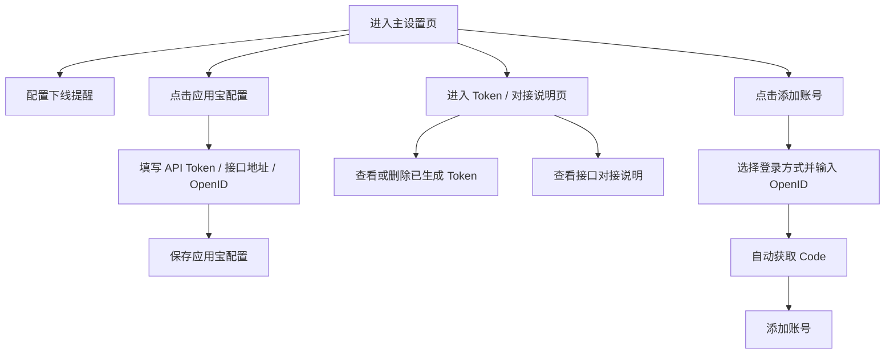

# QQ 农场智能助手 - 产品需求文档

## 1. 产品概述

QQ 农场智能助手是一个面向移动端的管理后台，用于配置账号下线提醒、应用宝一键登录参数、管理 OpenID 与 Token，并提供对接说明文档。项目目标是复现截图中的完整界面与交互，作为现有后端服务（`/workspace/core`）的可视化配置端。

- 主要用途：为农场脚本/助手提供 Token、OpenID、Code 等登录态的配置入口。
- 目标用户：使用 QQ 农场辅助工具的管理员或开发者。

## 2. 核心功能

### 2.1 功能模块

1. **主设置页**
   - 账号下线提醒配置（Token、标题、离线删除时间、内容）
   - 应用宝配置入口卡片
2. **应用宝配置弹窗**
   - API Token、接口地址配置
   - 定时重连间隔设置
   - 离线后自动重连开关
   - OpenID 列表的增删
3. **已生成 Token 页**
   - Token 列表展示与删除
   - 对接说明文档（接口地址、鉴权方式、支持/不支持功能、请求体与 curl 示例）
4. **添加账号弹窗**
   - 账号备注
   - 登录方式选择（QQ 小程序 / 微信小程序 / 应用宝）
   - OpenID 输入与自动获取 Code

### 2.2 页面详情

| 页面/弹窗 | 模块 | 功能描述 |
|-----------|------|----------|
| 主设置页 | 下线提醒表单 | 配置接收端 Token、通知标题、离线删除秒数、通知内容，支持测试通知与保存 |
| 主设置页 | 应用宝配置卡片 | 展示应用宝配置说明，点击打开配置弹窗 |
| 应用宝配置弹窗 | 表单与列表 | 填写 API Token、接口地址、重连间隔，管理 OpenID 列表 |
| Token 与对接说明页 | Token 表格 | 展示已生成 Token 名称、Token 值与删除操作 |
| Token 与对接说明页 | 对接说明 | 展示接口地址、鉴权、支持功能、请求示例与 curl 示例 |
| 添加账号弹窗 | 账号表单 | 选择登录方式，输入 OpenID，自动获取 Code，添加账号 |

## 3. 核心流程

## 4. 用户界面设计

### 4.1 设计风格

- **主色调**：米白/奶油色背景（`#F7F3E8` 近似），白色卡片，蓝色主按钮（`#4A90E2`），绿色文字用于取消/次要操作。
- **按钮样式**：大圆角胶囊按钮，主按钮蓝色实心，次要按钮浅灰边框。
- **字体**：移动端无衬线字体，标题加粗，表单标签灰黑色。
- **布局**：移动优先，单栏卡片堆叠；顶部标题栏带图标与菜单按钮。
- **图标**：应用宝使用彩色网格图标，麦穗图标用于标题。

### 4.2 页面设计概览

| 页面 | 模块 | UI 元素 |
|------|------|---------|
| 主设置页 | 顶部栏 | 麦穗图标、标题“QQ农场智能助手”、汉堡菜单 |
| 主设置页 | 下线提醒卡片 | Token/标题/秒数/内容输入框、测试通知按钮、保存按钮 |
| 主设置页 | 应用宝配置卡片 | 图标、标题、说明、配置按钮 |
| 应用宝配置弹窗 | 弹窗头部 | 标题、关闭按钮 |
| 应用宝配置弹窗 | 表单体 | API Token（带显隐切换）、接口地址、计数器、开关、OpenID 列表 |
| Token 与对接说明页 | Token 表格 | 名称、Token、删除按钮 |
| Token 与对接说明页 | 对接说明 | 表格、代码块 |
| 添加账号弹窗 | 账号表单 | 备注、单选登录方式、OpenID 输入+获取 Code 按钮、Code 输入、取消/添加按钮 |

### 4.3 响应式

- 移动优先，最大宽度 480px 居中显示。
- 在桌面端以手机外框形式展示，保持触控友好的按钮尺寸（最小 44px）。

## 5. 非功能性需求

- 使用 React + Vite + Tailwind CSS 构建。
- 状态使用 React Hook 管理，无需后端（前端 mock 数据）。
- 代码块支持一键复制。
- 弹窗出现时禁止底层滚动。
