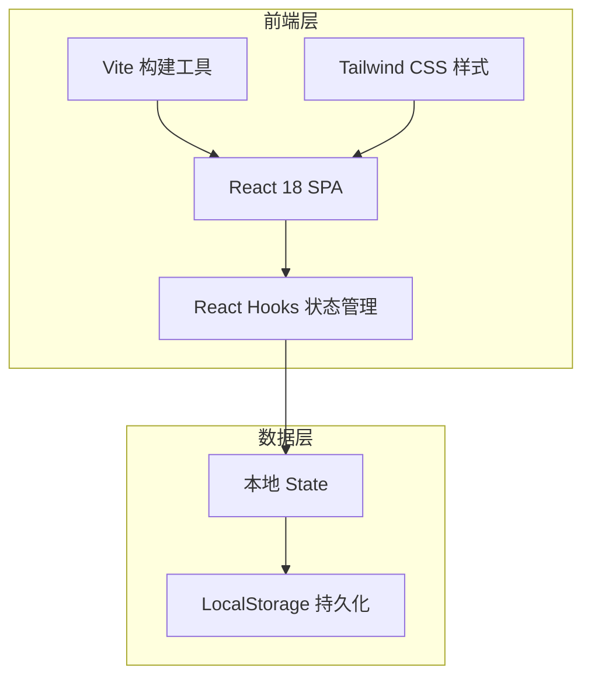

# QQ 农场智能助手 - 技术架构文档

## 1. 架构设计



## 2. 技术描述

- **前端框架**：React@18
- **构建工具**：Vite@5
- **样式方案**：Tailwind CSS@3
- **状态管理**：React `useState` / `useEffect` + `localStorage`
- **图标**：内联 SVG（无需额外图标库依赖）
- **后端**：无（复用现有 `/workspace/core` 服务，前端通过 mock 数据演示）

## 3. 路由定义

| 路由 | 用途 |
|------|------|
| `/` | 主设置页 |
| `/tokens` | 已生成 Token 与对接说明页 |

## 4. API 定义

前端 mock 对接的后端接口：

```typescript
interface FarmCodeRequest {
  openid: string;
}

interface FarmCodeResponse {
  code: string;
}
```

| 接口 | 方法 | 说明 |
|------|------|------|
| `POST {apiUrl}` | 请求体 `{ openid }` | 根据 OpenID 获取登录 Code |

## 5. 数据模型

### 5.1 应用宝配置

```typescript
interface YybConfig {
  apiToken: string;
  apiUrl: string;
  reconnectInterval: number; // 分钟
  autoReconnect: boolean;
  openIds: string[];
}
```

### 5.2 下线提醒配置

```typescript
interface OfflineReminder {
  token: string;
  title: string;
  offlineDeleteSeconds: number;
  content: string;
}
```

### 5.3 账号

```typescript
type LoginMethod = 'qq' | 'wechat' | 'yyb';

interface Account {
  id: string;
  remark: string;
  method: LoginMethod;
  openId: string;
  code: string;
}
```

### 5.4 Token

```typescript
interface GeneratedToken {
  id: string;
  name: string;
  token: string;
}
```

## 6. 组件结构

```
src/
├── App.tsx                 # 路由与布局
├── main.tsx                # 入口
├── index.css               # Tailwind 引入与全局样式
├── components/
│   ├── Header.tsx          # 顶部标题栏
│   ├── OfflineReminderCard.tsx
│   ├── YybConfigCard.tsx
│   ├── YybConfigModal.tsx
│   ├── AddAccountModal.tsx
│   ├── TokenPage.tsx
│   └── CodeBlock.tsx
├── hooks/
│   └── useLocalStorage.ts
└── types/
    └── index.ts
```

## 7. 构建与运行

```bash
cd /workspace/frontend
npm install
npm run dev      # 开发预览
npm run build    # 生产构建
```

生产构建输出到 `frontend/dist/`。
